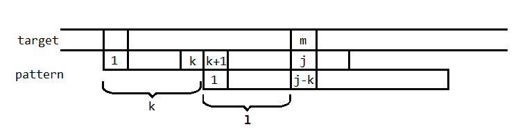

# KMP算法

KMP算法，是由Knuth，Morris，Pratt共同提出的模式匹配算法。KMP算法通过构造跳转表减少匹配次数。

参考：http://blog.csdn.net/joylnwang/article/details/6778316

为了便于理解问题的来龙去脉，下面的描述是我自己的版本。

## 基本问题

假设现有模式串pattern和目标穿target，期望在目标串中找到与模式串相同的字串。一个最朴素的办法是从target的某位置i与pattern各位比较，若匹配失败则从target[i+1]开始重新匹配；i从1开始重复这一过程。

然而若我们进行思考，假如匹配进行到pattern[j]失败，那么说明pattern[1~j-1] = target[i~i+j-2] (j>1)，因而target[i~i+j-2]的信息已蕴含在pattern中。这说明一定可以通过分析pattern串以某种方式避免target中比较位置的回溯。在这种情况下，target[i+j-1]才是我们还未得知确切信息的位置（也就是当前target串的比较位置），因而应将pattern某位与target[i+j-1]对齐，并继续向后匹配。

因此问题转换为（构造一个自动机：）对pattern[j]求出next[j]，表示在匹配进行到pattern[j]与target[m]失败时:

1）j>1,将pattern串向后移动next[j]位，target比较位置不变继续进行匹配。即target[m]与pattern[j-next[j]]对齐继续比较。

2）j=1，则pattern[1]与target[m+1]开始重新比较。

（这里我选择的next[j]的含义可能与其他文章的不一样，但意思是这个意思）

## 跳转表的构建

首先分析next[j]满足怎样的性质。

如上图所示，假设target[m]与pattern[j]匹配失败，(j>1)需要将pattern后移k位，并从target[m]与pattern[j-k]开始比较。则：

- pattern[1~j-k-1] = pattern[k+1~j-1]

- 由于不能遗漏可能的匹配位置，因而所求的k应为满足条件的最小的值，即满足要求的前缀串的长度l取最大的一个。(l = j-k-1)

则所求问题转换为:对pattern[j]求满足pattern[1~l-1] = pattern[j-l~j-1]且l != j-1的最大的l。
并且next[j] = j-l-1. （pattern[1]可做个别考虑）

例如，对于模式串“abcabcacab”，计算可得：

<table border="1" align="center">
  <tr>
    <th>i</th>
    <th>1</th><th>2</th><th>3</th><th>4</th><th>5</th><th>6</th><th>7</th><th>8</th><th>9</th><th>10</th>
  </tr>
  <tr>
    <th>pattern[i]</th>
    <th>a</th><th>b</th><th>c</th><th>a</th><th>b</th><th>c</th><th>a</th><th>c</th><th>a</th><th>b</th>
  </tr>
  <tr>
    <th>l[i]</td>
    <td>0</td><td>0</td><td>0</td><td>0</td><td>1</td><td>2</td><td>3</td><td>4</td><td>0</td><td>1</td>
  </tr>
 <tr>
    <th>next[i]</td>
    <td>0</td><td>1</td><td>2</td><td>3</td><td>3</td><td>3</td><td>3</td><td>3</td><td>8</td><td>8</td>
  </tr>
</table>

由于所要求的l是最大且不等于j-1的，因而一个朴素的方法可以从pattern[2]开始向后寻找与前缀串重复的到pattern[j-1]的子串。则先找到的满足l最大，若未找到则l=0.

然而在计算中我们可发现一些计算结果是可以被重复利用的。例如：l[7]=3，即pattern[1~3]=pattern[4~6]。在计算l[8]时，由于pattern[7]=pattern[4]，
因而可以直接得到l[8]=l[7]+1=4。而如果pattern[7]!=pattern[4]，则可以再用朴素方法搜索小于l[4]+1长度的重复子串。(不可能存在更长的子串，否则l[4]也会更大，对吧？)

## 一些改善

### 1.优化next表

注意到当target[m]与pattern[j]匹配失败，尽管这一事实无法让我们能够确定target[m]的值，但依旧提供了关于target[m]的一些信息：即target[m] != pattern[j] （废话）。有了这一信息，我们可以进一步优化跳转表使得一些情况下避免徒劳的匹配。

例如：在求l[7]时，除了pattern[1~3]=pattern[4~6]我们还看到pattern[4]=pattern[7]，而target[m]!=pattern[7]，因而下一步将pattern移动三位进行匹配也是徒劳的，因为pattern[4]!=target[m]。因而实际相当于再移动next[4]位再进行匹配。

所以，优化后的next求法为：

- pattern[l[j]+1] = pattern[j]，则  next[j] = j-l-1 + next[l[j]+1]
- pattern[l[j]+1] != pattern[j]，则  next[j] = j-l-1

因而优化有：

<table border="1" align="center">
  <tr>
    <th>i</th>
    <th>1</th><th>2</th><th>3</th><th>4</th><th>5</th><th>6</th><th>7</th><th>8</th><th>9</th><th>10</th>
  </tr>
  <tr>
    <th>pattern[i]</th>
    <th>a</th><th>b</th><th>c</th><th>a</th><th>b</th><th>c</th><th>a</th><th>c</th><th>a</th><th>b</th>
  </tr>
  <tr>
    <th>l[i]</td>
    <td>0</td><td>0</td><td>0</td><td>0</td><td>1</td><td>2</td><td>3</td><td>4</td><td>0</td><td>1</td>
  </tr>
 <tr>
    <th>next[i]</td>
    <td>0</td><td>1</td><td>2</td><td>3</td><td>4</td><td>5</td><td>6</td><td>3</td><td>8</td><td>9</td>
  </tr>
</table>

（上面的对于next[j]等于j的情况有所特殊，例如对于pattern[4]其实可移动4位并且将目标串移动一位。为统一过程这里为移动3位与pattern[1]比较，失败后再转为移动目标串的情况。实际实现可根据情况选则next[1]的值与执行的流程。）

### 2.查找所有匹配

应用中可能希望找到所有匹配或统计匹配数量。可以在pattern串末尾添加一个特殊字符，使得与该字符匹配一定失败。对于匹配成功后下一步的跳转位置则与其他next数组的值一样计算。

    
