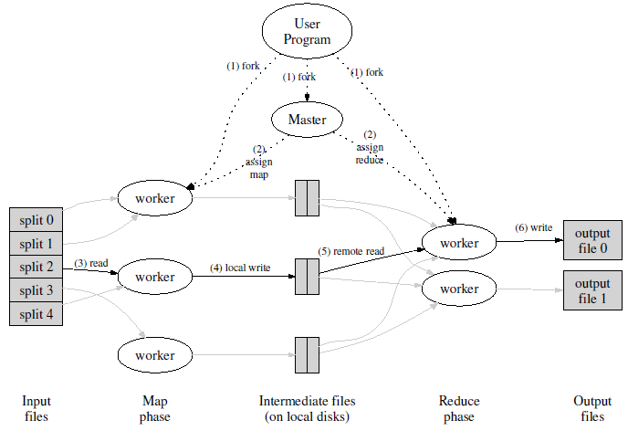

###
阅读笔记： MapReduce: Simplified Data Processing on Large Clusters (google)(1)

## 0. 概述

MapReduce是一种编程模型，是处理和生成大型数据集合的关联的实现。用户指定一个**map函数**用于处理一个key/value值对，以生成一个中间的key/value值对集合；指定另一个**reduce函数**来合并与同一个中间key相关联的中间value。

这种函数式风格编写的程序自动地并行化斌执行在机器集群上，由运行时负责具体的切割输入数据、调度、错误处理和机器间通信等。因而编程者无需具有并行和分布式系统的相关经验。谷歌实现了很多MapReduce程序并运行在服务器上，处理TB级数据，具有高扩展性。

## 1. 介绍

谷歌工程师在本文的过去五年面对了数以百计的具有特定目的的问题：处理大量的raw data（包括网上爬下来的文档、网页请求等）来计算各种derived data（例如各种图的方式表示的网络文档、每个主机上爬下来的页面数、对高频请求的总结等）。这些计算在概念上基本都很直接，然而输入数据往往很大以至于计算任务需呀分布在成百上千的机器上，才能在合理的时间内得到结果。因而如何并行化这些计算、部署数据、处理错误这些问题，合起使得要增加大量复杂的的代码来处理它们，原本相对简单的问题变得复杂。

为了解决这个问题，他们设计了一种新的抽象，将并行化、容错、数据分布和负载均衡的纷乱细节封装在一个库中，使得表达简单的计算任务时不必理会这些细节。其灵感来源于出现于Lisp等函数式语言中的map和reduce原语。作者发现大部分这类的计算都涉及到对输入中的每个记录进行一个**map**操作，来计算出一个中间的key/value值对；再对所有共享同一个key的value进行一个**reduce**操作，来恰当地合并derived data。使用了一个函数式的模型和用户指定的map和reduce操作来并行化大型计算，容错主要使用再执行（re-execution）机制。

## 2. 编程模型

计算过程接受一系列输入key/value对，产生一系列输出key/value对。用户编写**Map**函数，接受一个输入对，产生一个**中间**key/value对集合；随后MapReduce库将所有与中间key **I**相关联的中间值聚集在一起，并传给Reduce函数。**Reduce**函数也由用户编写，接受一个中间key I和相应的值的集合，将所有的值合并生成一个通常更小的值集合。中间值是通过一个迭代期传给用户的reduce函数，使得超过内存容纳范围的值的序列可被处理。

###类型

从概念上，map和reduce函数有如下相关联的类型：

	map		(k1,v1)			--> list(k2,v2)
	reduce	(k2,list(v2))	--> list(v2)

###例子

1. 统计大量文本中单词出现次数：

	map函数的输入为<文档名，内容>，输出为<单词，1>；reduce函数输入为<key=单词，Iterator count>，输出为count相加。

2. 分布式的grep：

	若某行符合匹配模式，则map函数添加该行；reduce函数是一个恒等函数，直接将中间结果输出。

3. URL访问频率计数：

	与例子1相似。

4. 反转web-link图：

	map函数对于每个在页面source中找到的指向target URL的连接生成一个<target, source>对。reduce函数将所有指向target的source URL连成一个列表提交<target, list(source)>对（就是reduce没做什么，只是把传入的value穿成链表提交）。

5. 每个主机的Term-Vector：

	term-vector（词语向量）以<word,frequency>的列表的形式总结一个或一系列文档中出现的的最重要的单词。

6. 反转index：

	map函数对每个文档进行parse并生成一系列<word, document ID>对。reduce函数接受一个单词的所有结果，将相应document ID排序并生成一个<word, list(document ID)>对。再次实现基础上可以增加记录单词位置的功能。

7. 分布式的排序：

	map函数从每个记录中提取key，并提交一个<key, record>对。reduce函数保持不变地提交每个对。由MapReduce的partition工具和排序性质支持实现该功能。

##3. 实现

MapReduce模型可以有多种不同的实现方式。如何正确选择取决于具体的环境。例如，一种实现方式适用于小型的共享内存方式的机器，另外一种实现方式则适用于大型NUMA架构的多处理器的主机，而有的实现方式更适合大型的网络连接集群。

本章节描述一个适用于Google内部广泛使用的运算环境的实现：用以太网交换机连接、由普通PC机组成的大型集群。在我
们的环境里包括：

1. x86架构、运行Linux操作系统、双处理器、2-4GB内存的机器。
2. 普通的网络硬件设备，每个机器的带宽为百兆或者千兆。 
3. 集群中包含成百上千的机器，因此，机器故障是常态。
4. 存储为廉价的内置IDE硬盘。一个内部分布式文件系统用来管理存储在这些磁盘上的数据。文件系统通过数据复制来在不可靠的硬件上保证数据的可靠性和有效性。
5. 用户提交工作（job）给调度系统。每个工作（job）都 包含一系列的任务（task），调度系统将这些任务调度到集群中多台可用的机器上。

###3.1 执行概述

通过自动地将输入分为M份，Map的调用被分布到多个机器。Reduce的分布化是通过使用一个分割函数（hash(key) mod R）将中间key空间分为R个部分。分割数R和分割函数由用户指定。图1展示了MapReduce的执行流。

当用户程序调用MapReduce函数，执行以下步骤（与上图中标号对应）：

1. 用户程序的MapReduce库首先将输入文件分成M块，每块的典型大小为16-64MB（由用户控制），随后在机器集群上启动该程序的多个副本。
2. 程序副本中有一个是特别的，称为master，剩下的称为worker。由master向worker分配任务。共有M个map任务和R个reduce任务。master选择限制的worker来分配一个map或reduce任务。
3. 一个分配了map任务的worker读取相应的输入片段的内容，从中解析key/value对并传给用户指定的Map函数。Map函数产生的中间key/value对还存在内存中。
4. 被缓存的值对周期性地写入到本地磁盘，并由分割函数分成R个区域。这些值对的位置被传回给master，master负责把位置信息通知给负责reduce的worker。
5. 当一个负责reduce的worker获得了master通知的位置信息，则使用远程过程调用来从map worker的本地磁盘读取缓存的数据。当reduce worker读取了所有中间结果，它会将这些结果按照中间key排序，使得所有同一个关键字的实例被聚集在一起。如果中间数据过大而不能放入内存，则使用外部排序。
6. reduce worker对遇到的每个唯一的中间key对应的中间数据进行迭代，将这个key和相应的只能关键值的集合传给用户的Reduce函数。Reduce函数的输出追加在该reduce分块的输出文件末尾。
7. 当所有map和reduce任务都完成后，master唤醒用户程序（结束）。

在一次成功的执行后，mapreduce的结果保存在R个输出文件中。通常用户并不需要合并这些输出文件，而是将这些文件作为另一个MapReduce调用的输入、或者用于另一个分布式的应用。

###3.2 Master数据结构

master维护数个数据结构。对于每个map或reduce任务，保存状态（闲置的(idle)\进性中(in-progress)\完成(completed)）和worker的id（对非闲置的任务）。

master充当将中间文件区块的位置从map任务传输给reduce任务的管道。因此，对每个完成了的map任务，master要存储R个中间文件区块的位置和大小。这些信息是增量推送给有着进行中的reduce任务的worker。

###3.3 容错（fault tolerance）

由于MapReduce库是用于在成百上千的机器上处理非常大量的数据，必须进行良好的容错处理。

####worker 错误

master周期性地向每个worker发送ping。如果没有在一定时间内从某个worker收到回答，则将这个worker标记为失败的。任何被失败的worker完成的任务都被重新标记为闲置的，并可被分配给其他worker。相似地，任何在失败的worker上的进行中的map或reduce任务也被重置为闲置的并进入重新分配。

遇到故障时已完成的map任务被重新新执行，因为这些结果被存储在失效机器的本地磁盘上。完成的reduce任务无需重复执行，因为其结果存放在global的文件系统中。

当一个原来在worker A上的map任务由于在worker A失败而被worker B重新执行，则通知执行reduce任务的worker。还没有从worker A读取信息的reduce任务会从worker B读取数据。

MapReduce对大规模的worker故障具有弹性。

####master 故障

master持有的数据可以周期性地以checkpoint保存，如果master任务失败，则从最后一个checkpoint开始新副本。不过，由于master只有一个，其失效不太可能发生；因而在实现上可以在master失效时退出MapReduce任务，再由用户检查并决定是否重新执行。

####Semantics in the Presence of Failures

当用户提供的map和reduce函数对其输入具有确定结果，则该分布式实现对出错情形应当产生与未出错情形相同的结果。通过map和reduce任务的原子的commit来实现这一性质。

每个进行中的任务将结果写入到私有的临时文件。一个reduce任务生成一个该类文件，一个map任务生成R个。当一个map任务完成，worker向master发送一个包含这些文件的文件名的消息。master在一个数据结构中记录这些文件名（如果重复收到消息则忽略）。当一个reduce任务完成，reduce worker将其临时文件重命名为最终输出文件。（reduce任务可能有重复，通过原子的重命名操作保证最后结果只含单次reduce任务执行结果。）

使用MapReduce模型的程序员可以很容易的理解程序行为，因为我们绝大多数的Map和Reduce操作是确定性的。当Map或/和Reduce操作是不确定性的时
候，提供了虽然较弱但是依然合理的语义学。

###3.4 Locality（局部性）

网络带宽在google的计算环境是较缺乏的资源，因此利用了输入数据存放在机器集群的本地磁盘（由GFS管理）这一事实来节约网络带宽。GFS将每个文件分为64MB大小的块，并在不同的机器上存放多个副本（通常3个）。MapReduce master接受和记录输入文件的位置信息，并尝试在含有一个该数据副本的机器上分配map任务；如果失败了，则尝试在临近的机器上布置map任务（例如map任务worker与含有任务输入数据的机器在同一网络）。通过这种方式节约网络带宽。

###3.5 任务粒度

上面提到，map阶段分为M部分，reduce分为R份。理想上M和R应该大于worker机器的数量。这样会利于动态的负载均衡，并加快某个worker失效时的恢复：失效worker上的多个任务可以被分散到其他worker上。

在实现上M和R的大小具有上界。这是由于master需要进行O(M+R)个任务调度并且保存O(M*R)个状态信息。

此外，由于每个reduce任务产生单独的输出文件，用户通常会限制R的大小。实际中，通常选择M使得每个任务具有16-64MB大小的输入文件（使得局部化效果最好），选择R为可用机器数的一个较小的倍数。（例：M=200000，R=5000，运行在2000个worker机器上）

###3.5 Backup Tasks（后备任务）

一个延长MapReduce总执行时间的常见原因是“掉队者”：某个花费异常长的时间完成最后几个map或reduce任务的机器。掉队者原因有很多。例如磁盘错误导致的读取速度大幅降低；其他任务引起的CPU、内存、磁盘、网络带宽的竞争；等等（还举了一个cache失效的例子）。

我们使用一个通用的方式缓解这一问题。当一个MapReduce操作接近完成，master对剩余的进行中的任务调用后备的执行。当主要执行或后备执行之一完成，该任务被标记为完成的。这一机制可被调整使得增加的计算资源提高几个百分点，并在实际执行时大幅降低MapReduce总执行时间。

   