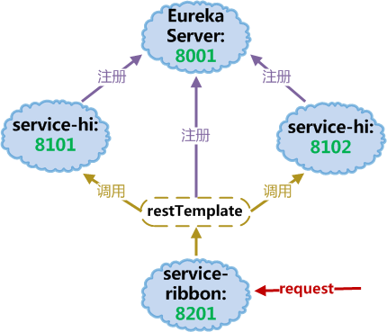

# 服务消费者

概念：

- 服务提供者：服务的被调用方（即：为其他服务提供服务的服务）
- 服务消费者：服务的调用方（即：依赖其他服务的服务）

分布式系统下，每个服务可部署多个实例，因此消费服务需要考虑负载均衡问题。Spring cloud 消费/调用服务有两种方式：一种是 **ribbon+restTemplate** ，另一种是 **feign** 。

## 1. ribbon

Ribbon是一个客户端负载均衡器，可以很好的控制http和tcp客户端的一些行为。Feign中集成了ribbon。

### 1.1 准备

- 启动 Eureka Server 工程（端口号8001）

- 启动多个服务提供者(eureka client)：启动上一篇建立的 `service-hi` 工程（端口号8101）；更改端口号（如：8102），并再次启动 service-hi 工程。（IDEA中需要设置run选项，取消单例模式。）

此时访问 Eureka Server 界面，可以看到`service-hi`注册了2个实例，相当于建立了一个小型集群。

### 1.2 建立工程

新建一个spring-boot工程，取名为：`service-ribbon`。需要在pom中添加依赖：

```xml
<dependencies>
	<dependency>
		<groupId>org.springframework.cloud</groupId>
		<artifactId>spring-cloud-starter-eureka</artifactId>
	</dependency>
	<dependency>
		<groupId>org.springframework.cloud</groupId>
		<artifactId>spring-cloud-starter-ribbon</artifactId>
	</dependency>
	<dependency>
		<groupId>org.springframework.boot</groupId>
		<artifactId>spring-boot-starter-web</artifactId>
	</dependency>
    ...
</dependencies>
```

在配置文件指明服务的注册中心地址为`http://localhost:8001/eureka/`，程序名称为 service-ribbon，程序端口为 **8201**。

### 1.3 restTemplate

在工程的启动类中,通过`@EnableDiscoveryClient`向服务中心注册；并且注入一个bean: `restTemplate`;并通过`@LoadBalanced`注解表明这个`restRemplate`开启负载均衡的功能:

```java
@EnableAutoConfiguration
@SpringBootApplication
@EnableDiscoveryClient
public class ServiceRibbonApplication {

    public static void main(String[] args) {
        SpringApplication.run(ServiceRibbonApplication.class, args);
    }

    @Bean
    @LoadBalanced
    RestTemplate restTemplate() {
        return new RestTemplate();
    }
}
```

### 1.4 服务消费者

写一个controller，通过`restTemplate`来消费`service-hi`服务的`"/hi"`接口。这里我们用程序名替代了具体的url地址，ribbon会根据服务名来选择具体的服务实例，根据服务实例在请求的时候会用具体的url替换掉服务名，示例代码如下：

```java
//@RestController：Spring4, 声明返回json字符串数据，可直接编写restfull接口.
@RestController
public class HelloControler {

    //Spring2.5 @Autowired注释，可对类成员变量、方法及构造函数进行标注，完成自动装配。
    //通过@Autowired消除 set ，get方法。
    @Autowired
    RestTemplate restTemplate;

    @RequestMapping(value = "/hi", method = RequestMethod.GET)
    public String hi(@RequestParam String name){
        //发送GET请求
        return restTemplate.getForObject("http://SERVICE-HI/hi?name=" + name, String.class);
    }

		@RequestMapping(value = "/hi", method = RequestMethod.POST)
    public String hiPost(@RequestParam String name){
        //发送POST请求
        String url = "http://SERVICE-HI/hi";
        //HashMap cannot be used for POST requests
        MultiValueMap<String, String> paramMap = new LinkedMultiValueMap<>();
        paramMap.add("name", name);
        return restTemplate.postForObject(url, paramMap, String.class);
    }
}
```

此时，在浏览器上多次访问 http://localhost:8201/hi?name=xxx ，交替显示：

```
hi xxx,i am from port:8101
hi xxx,i am from port:8102
...
```

至此，我们已经通过Ribbon在客户端侧实现了均衡负载。服务器的架构如下图所示：

<div align=center>

</div>

## 2. Feign

Feign是一个声明式的web服务客户端，它使得客户端编写变得更简单。使用Feign，只需要创建一个接口并注解。它具有可插拔的注解特性，可使用Feign 注解和JAX-RS注解。Feign还支持可插拔的编码器和解码器。Feign默认集成了Ribbon，实现负载均衡的效果。

### 2.1 准备

同上一节类似，启动 Eureka Server 工程，端口号8001；
启动 `service-hi` 工程两次，端口号分别为8101、8102。

### 2.2 创建Feign服务

新建一个spring-boot工程，取名为`service-feign`，在pom文件引入Feign的起步依赖`spring-cloud-starter-feign`、Eureka的起步依赖`spring-cloud-starter-eureka`、Web的起步依赖`spring-boot-starter-web`:

```xml
<dependencies>
    <dependency>
        <groupId>org.springframework.cloud</groupId>
        <artifactId>spring-cloud-starter-eureka</artifactId>
    </dependency>
    <dependency>
        <groupId>org.springframework.cloud</groupId>
        <artifactId>spring-cloud-starter-feign</artifactId>
    </dependency>
    <dependency>
        <groupId>org.springframework.boot</groupId>
        <artifactId>spring-boot-starter-web</artifactId>
    </dependency>
      ...
</dependencies>
```

配置文件中端口配置为 **8301**，指定程序名为`service-feign`，其他与前面类似。

在程序的启动类`ServiceFeignApplication` ，加上`@EnableFeignClients`注解，开启Feign功能：

```java
@SpringBootApplication
@EnableDiscoveryClient
@EnableFeignClients
public class ServiceFeignApplication {

    public static void main(String[] args) {
        SpringApplication.run(ServiceFeignApplication.class, args);
    }
}
```

定义一个feign接口，通过`@FeignClient`+"服务名"，指定调用哪个服务:

```java
@FeignClient(value = "service-hi")
public interface SchedualServiceHi {
    @RequestMapping(value = "/hi",method = RequestMethod.GET)
    String sayHi(@RequestParam(value = "name") String name);
}
```

在controller层通过上面定义的Feign客户端`SchedualServiceHi` 来消费服务：

```java
@RestController
public class HiController {

    @Autowired
    SchedualServiceHi schedualServiceHi;
    @RequestMapping(value = "/hi",method = RequestMethod.GET)
    public String sayHi(@RequestParam String name){
        return schedualServiceHi.sayHi(name);
    }
}
```

与前面类似地，启动服务后在浏览器上多次访问 http://localhost:8301/hi?name=xxx ，会交替显示两个client返回的结果。


## ref:

ribbon:

http://blog.csdn.net/forezp/article/details/69788938

http://cloud.spring.io/spring-cloud-static/Finchley.M5/single/spring-cloud.html#spring-cloud-ribbon

http://book.itmuch.com/2%20Spring%20Cloud/2.3%20%E6%9C%8D%E5%8A%A1%E6%B6%88%E8%B4%B9%E8%80%85.html

feign:

http://blog.csdn.net/forezp/article/details/69808079

http://cloud.spring.io/spring-cloud-static/Finchley.M5/single/spring-cloud.html#spring-cloud-feign

http://www.mamicode.com/info-detail-1723937.html (Solr配置冲突解决)

<br/><br/>
