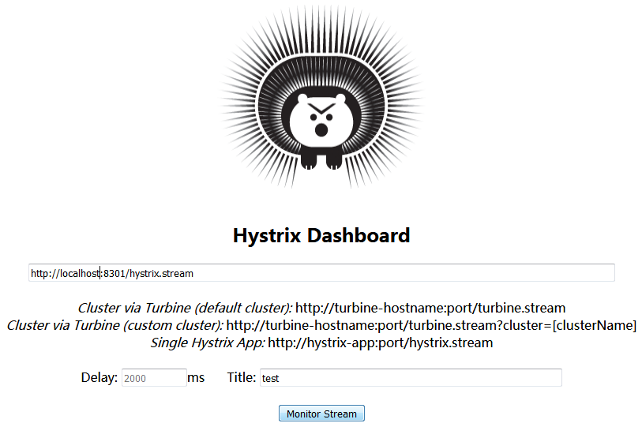

# 断路器（Circuit Breaker）

#### 雪崩效应

微服务架构中，服务与服务之间可以相互调用（RPC）。
若基础层的服务由于网络或自身等原因不可用，使得依赖于该服务的服务不可用，产生级联的故障。如果有大量请求，则关键资源可能被耗尽，对整个微服务系统造成灾难性后果。

#### 断路器

断路器（circuit breaker）的思想十分简单：用一个断路器包装受保护的方法调用，
对故障进行监控；一旦故障达到某个阈值（出现频率），断路器被触发，后续的调用直接返回错误，而不再调用被调用者。

断路器使得应用程序继续执行而不用被阻塞。断路器也可以使应用程序能够诊断错误是否已经修正，如果被修正则再次尝试调用操作。

Netflix开源了Hystrix库，实现了断路器模式。Spring Cloud整合了这一组件。

## 1. 在ribbon使用断路器（Hystrix）

在前面章节的`service-ribbon`项目pom中添加`spring-cloud-starter-hystrix`依赖:

```xml
<dependency>
    <groupId>org.springframework.cloud</groupId>
    <artifactId>spring-cloud-starter-hystrix</artifactId>
</dependency>
```

在程序的启动类`ServiceRibbonApplication` 加`@EnableHystrix`注解开启Hystrix：

```java
@SpringBootApplication
@EnableDiscoveryClient
@EnableHystrix
public class ServiceRibbonApplication {

    public static void main(String[] args) {
        SpringApplication.run(ServiceRibbonApplication.class, args);
    }

    @Bean
    @LoadBalanced
    RestTemplate restTemplate() {
        return new RestTemplate();
    }
}
```

使用`@HystrixCommand`注解，创建熔断器的功能，并通过`fallbackMethod`指定熔断方法。熔断方法`hiError`直接返回一个字符串。

```java
@RestController
public class HelloControler {

    @Autowired
    RestTemplate restTemplate;

    public String hiError(String name) {
        return "hi "+name+", sorry, error!";
    }

    @HystrixCommand(fallbackMethod = "hiError")
    @RequestMapping(value = "/hi")
    public String hi(@RequestParam String name) {
        return restTemplate.getForObject("http://SERVICE-HI/hi?name=" + name, String.class);
	}
}
```

启动eureka server和 `service-hi` 工程，启动`service-ribbon`，此时访问 http://localhost:8201/hi?name=xxx ，显示：

```
hi xxx,i am from port:8101
```

关闭 `service-hi` （client）工程，再访问 http://localhost:8201/hi?name=xxx ，显示：

```
hi xxx, sorry, error!
```

说明当 `service-hi` 工程不可用时，`service-ribbon` 调用 `service-hi` 的API接口会执行快速失败，直接返回字符串而不是等待响应超时，很好的控制了容器的线程阻塞。

## 2. 在Feign使用断路器

Feign中集成了Hystrix，然而在Spring Cloud Dalston版本以后是默认关闭的。因此需要在配置文件中开启：

```
feign.hystrix.enabled=true
```

在上一篇的`service-feign`工程上进行修改。

新建`SchedualServiceHiHystric`，实现`SchedualServiceHi`接口，并注入到Ioc容器：

```java
//@Component,@Service,@Controller,@Repository：纳入spring容器中管理。
@Component
public class SchedualServiceHiHystric implements SchedualServiceHi {
    @Override
    public String sayHi(String name) {
        return "sorry "+name;
    }
}
```

修改`FeignClient`(`SchedualServiceHi`接口)，添加`fallback`的指定类：

```java
@FeignClient(value = "service-hi", fallback = SchedualServiceHiHystric.class)
public interface SchedualServiceHi {
    @RequestMapping(value = "/hi",method = RequestMethod.GET)
    String sayHi(@RequestParam(value = "name") String name);
}
```

启动eureka server和 `service-hi` 工程，启动`servcie-feign`，此时访问 http://localhost:8301/hi?name=xxx ，显示：

```
hi xxx,i am from port:8101
```

关闭 `service-hi`，再次访问显示：

```
sorry xxx
```

说明断路器起到作用。

## 3. Hystrix Dashboard (Hystrix 仪表盘)

#### Hystrix监控

Hystrix还提供了近实时的监控。Hystrix会实时、累加地记录所有关于HystrixCommand的执行信息，包括每秒执行多少请求多少成功，多少失败等。

修改`service-feign`工程，在启动类上添加注解`@EnableCircuitBreaker`；项目依赖添加：

```xml
<dependency>
	<groupId>com.netflix.hystrix</groupId>
	<artifactId>hystrix-metrics-event-stream</artifactId>
</dependency>
```

启动`service-feign`工程，此时访问 http://localhost:8301/hystrix.stream 地址会持续输出监控数据：

    data: {"type":"HystrixCommand","name":"SchedualServiceHi#sayHi...

#### Hystrix Dashboard

Hystrix Dashboard可以可视化查看实时监控数据。Spring Cloud中Hystrix Dashboard的基本使用： (基于ribbon和feign的修改相同)

pom中添加依赖：

```xml
<dependency>
    <groupId>org.springframework.boot</groupId>
    <artifactId>spring-boot-starter-actuator</artifactId>
</dependency>
<dependency>
    <groupId>org.springframework.cloud</groupId>
    <artifactId>spring-cloud-starter-hystrix-dashboard</artifactId>
</dependency>
```

启动类中加入`@EnableHystrixDashboard`注解，开启Hystrix Dashboard:

```java
@SpringBootApplication
@EnableDiscoveryClient
@EnableFeignClients
@EnableCircuitBreaker
@EnableHystrixDashboard
public class ServiceFeignApplication  {
	public static void main(String[] args) {
		SpringApplication.run(ServiceFeignApplication .class, args);
	}
}
```

启动工程后访问 http://localhost:8301/hystrix.stream 地址，会显示页面：



输入 http://localhost:8301/hystrix.stream 并任意设置title后点击 Monitor Stream，可以看到实时监控面板。指标含义图例如下：


---

## ref

https://martinfowler.com/bliki/CircuitBreaker.html

http://cloud.spring.io/spring-cloud-static/Finchley.M5/single/spring-cloud.html#_circuit_breaker_hystrix_clients

http://blog.csdn.net/forezp/article/details/69934399 （Hystrix）

http://book.itmuch.com/2%20Spring%20Cloud/2.4%20%E7%86%94%E6%96%AD%E5%99%A8.html （Circuit Breaker）

</br></br>
