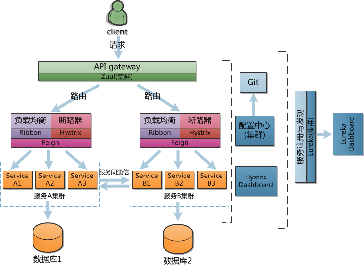

# Spring Cloud 总体架构

前面的章节介绍了Spring Cloud一些基本组建的功能和使用，这里进行一下总结，并通过一个微服务的整体架构示例，直观展示组件之间的联系、各组件如何协同工作。

## 微服务架构

下图示意了一个简单的微服务系统的组成：

## 功能模块

从上面可以看出，微服务访问的大致路径为：
**外部请求 → 服务网关（GateWay）→ 负载均衡 → 微服务 → 数据服务/消息服务**。
服务网关和微服务都通过服务注册和发现来调用依赖的其他服务，通过配置中心服务获得配置信息。

主要组件回顾：

- 路由：

  API Gateway封装系统内部的架构。负责请求转发、合成和协议转换。所有来自客户端的请求都要先经过API Gateway，然后路由这些请求到对应的微服务。当服务网关以集群形式部署，则需要进行负载均衡。

  Zuul：动态路由、监控、回退、安全等边缘服务。Zuul提供了一系列不同类型的过滤器（Filter）。

- 负载均衡

  - Ribbon：负载均衡客户端。

  - Hystrix组件实现了断路器，通过fallback机制实现快速失败。Hystrix Dashboard能够近实时地监控HystrixCommand的执行状态。

  - Feign中集成了Ribbon和Hystrix。

- 微服务

  将业务拆分为独立的单元，伸缩性好、耦合度低，不同的微服务可以用不同的语言开发，每一个服务处理的单一的业务。服务可以运行在Docker容器中，从而简单、高效地部署。每个Docker容器中可以运行多个微服务，Docker容器以集群的方式部署。

- 服务注册与发现

  由于微服务架构是由一系列职责单一的细粒度服务构成的网状结构，因此需要通过服务注册与发现解决服务间通信的问题。

  Eureka组件:实现服务的注册与发现。微服务均在Eureka服务器中进行注册，并定时发送心跳。若一定时间没有接收到心跳，会认定服务已不可用。当需要调用服务时，在Eureka服务器上查找目标服务的注册信息，发现目标服务并进行调用。

- 配置中心

  分布式系统的各个服务有很多配置信息，某些配置参数在服务运行期间可能还要动态修改。通过Spring Cloud Config可以实现统一管理和动态修改配置，以免每次修改参数都需要重新打包。Config Server可从Git仓库读取配置文件的信息，并在代码更新后自动刷新配置。

上面列举了一些微服务系统基本组件，此外还可以引入日志服务组件、消息服务组件等等。

## ref:

http://www.adeveloperdiary.com/java/spring-boot/develop-microservices-using-netflix-oss-spring-boot/

http://www.cnblogs.com/fangfuhai/p/7065847.html

  
