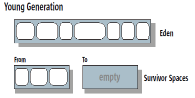

## summary: Memory Management in the Java HotSpot™ Virtual Machine
## 2. J2SE 5.0 HotSpot JVM 的垃圾回收器

J2SE 5.0 update 6 包括四个垃圾回收器，它们都是分代的。

####HotSpot分代

HotSpot虚拟机的存储分为三个代：一个年轻代、一个老年代和一个持久代。大多数对象分配在年轻代。老年代包括从年轻代存活过一定回收次数的对象，和少数直接分配在老年代的较大的对象。持久代存储便于垃圾回收器管理的对象，如描述类和方法的对象、以及类和方法本身。

如图，年轻代由一个称为Eden的区域和两个生存区组成。大多数对象（除了分配在老年代的）都分配在Eden。生存区存放至少活过一轮收集的对象。任一时刻两个是生存区有一个存放这些对象，另一个直到下次收集前都是空的。

关于分配，当存在较大的连续内存区时，只需记录空闲区开始位置，通过更新指针的方法就可实现快速分配（当有足够空间时）。而对于多线程的应用，需要保证线程安全性。如果使用一个全局的锁，则分配操作会成为性能瓶颈。HotSpot JVM使用Thread-Local Allocation Buffers (TLABs)，即给每个线程独立的buffer用于分配。

####垃圾回收过程

当年轻代被填满时，仅对这一代进行年轻代收集（也称为次要收集）。

当年老代或持久代被填满，进行整体收集（也称主要收集）：所有代都进行收集。通常年轻代先进行收集（使用年轻代的垃圾回收算法），然后老年代和持久代进行老年代的垃圾回收算法。如果发生紧凑，则各代分别进行。

有时年老年代太满，无法容纳年轻代要提升的对象。这种情况下，除了CMS回收器之外，在整个堆上进行老年代垃圾回收算法。

###1. Serial Collector 串行回收器

在串行回收器中，年轻代与老年代的回收都是串行地进行，使用单个CPU，当垃圾回收进行时应用程序完全停止。

#### 串行回收器的年轻代回收

