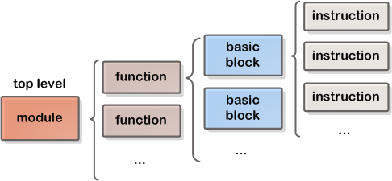

# LLVM 笔记3：LLVM 中间表示

编译过程中的各种变换都涉及对中间表示的处理，中间表示的设计对编译器的整体结构、效率和健壮性都有着极大的影响。
编译器 IR 的设计理念有：

- high-level IR： 抽象层次较高的中间表示。优点是容易优化，前后端通用性较高。

- low-level IR： 抽象层次较低。优点是容易生成目标相关代码、针对特定的目标机器进行优化；缺点是一般性较差，不利于对多个不同架构生成目标代码。

GCC 和 LLVM 这些支持多种平台的编译器称为 *retargetable compilers*（目标可重定的编译器） ，需要具有通用性的 high-level IR 以控制开发成本。在通用性 IR 上可以进行目标无关优化。另一方面，一个好的 retargetable compiler 为了实现目标相关的优化，还应该同时结合使用 lower level IR。

## LLVM IR

"LLVM IR" 特指 LLVM 中最具有一般性的中间表示，使用 `Function` 和 `Instruction` 等类表示。除此以外 LLVM 还使用了其他层次的 IR，但官方上，LLVM IR 仅指 `Instruction` 类等。LLVM IR 有三种等价形式：内存表示，bitcode file，LLVM assembly file。

下图展示了 LLVM IR 的基本模型。



- 模块（`Module`）是最顶层结构，由若干 function 组成，此外还包含全局变量、target data layout、外部函数原型、数据结构声明等.

- 函数（`Function`）包含与函数定义和声明有关的对象：参数列表、基本块等。

- 基本块（`BasicBlock`）：由一系列 Instruction 构成。一个基本块只有一个入口和一个出口，入口就是其第一条语句，出口就是其最后一个语句。一个基本块的执行只能从入口开始至出口结束。

- 指令（`Instruction`）：LLVM 的基本执行单元。按照类型有 LoadInst, StoreInst, CmpInst, BranchInst 等。BranchInst 只能出现在基本块结尾；Phi instruction 只能出现在基本块开头。

（个人理解，Phi/φ 指令用于实现 branching、保存前继节点和 value 的生存期间的关系）

### LLVM 字节码

以一个简单的函数为例。源代码文件 sum.c 的内容为：

```c++
int sum(int x, int y) {
	return x + y;
}
```

将源程序编译为LLVM字节码文件：

    $ clang sum.c -emit-llvm -c -o sum.bc

使用 llc 工具（LLVM build 生成）可以将字节码文件编译为可执行文件：

    $ llc -filetype=obj sum.bc

生成 LLVM assembly 文件：

    $ clang sum.c -emit-llvm -S -c -o sum.ll

查看 assembly 文件，可以看到函数体被翻译为：

```
define i32 @sum(i32 %a, i32 %b) #0 {
entry:
  %a.addr = alloca i32, align 4
  %b.addr = alloca i32, align 4
  store i32 %a, i32* %a.addr, align 4
  store i32 %b, i32* %b.addr, align 4
  %0 = load i32* %a.addr, align 4
  %1 = load i32* %b.addr, align 4
  %add = add nsw i32 %0, %1
  ret i32 %add
}
```

LLVM 语法的一些基本性质：

- 采用单静态赋值形式 （Static Single Assignment, SSA），易于分析和优化。

- 指令为三地址码——每条指令包括两个源操作数和一个目的操作数。

- 寄存器的个数没有上限。LLVM local value 相当于寄存器。
LLVM local value 的命名以 `%` 开头，global value 以 `@` 开头。

### iterators

对中间表示进行处理常常要对 IR 结构进行遍历，通过 iterator 可以很方便地进行遍历。Iterators 可通过 `begin()` 和 `end()`方法获取。

- `Module::iterator`

  Iterates through functions in the module

- `Function::iterator`

  Iterates through a function's basic blocks

- `BasicBlock::iterator`

  Iterates through instructions in a block

此外，通过 LLVM IR 的`Value` 和 `User` 接口可以以 “use-def” 和 “def-use” 链的方式使用 IR。某个类继承`Value`，表示它定义了一个可被其他类使用的结果；某个类`User`，表示它可以使用一个或多个`Value`。`Function`和
`Instruction`都同时继承了`Value` 和`User`，而`BasicBlock`只继承了
`Value`。

- `Value::use_iterator`

  Iterates through users. Obtained by `use_begin()` and `use_end()`

- `User::op_iterator`

  Iterates over values. Obtained by `op_begin()` and `op_end()`

#### 向 BasicBlock 中插入 Instruction

LLVM 中可以方便地在新建 Instruction 的同时将其插入到 BasicBlock 中。例如（<font color="red">注意插入的位置</font>）：

```c++
LoadInst x,y = ...
Instruction * p = ...
BasicBlock::iterator itr = ...
BasicBlock * bb = ...

//插入到指针 p 之前
BinaryOperator op1 = BinaryOperator::Create(Instruction::Add,
	 						(Value *)x, (Value *)y, "", p);
//插入到 iterator itr 之前
BinaryOperator op2 = BinaryOperator::Create(Instruction::Add,
	 						(Value *)x, (Value *)y, "", &*itr);
//插入到基本块 bb 结尾
BinaryOperator op3 = BinaryOperator::Create(Instruction::Add,
	 						(Value *)x, (Value *)y, "", bb);
```

BasicBlock 的 `begin()`、 `end()` 函数返回 `BasicBlock::iterator`，
iterator 上可以进行 `++` 和 `--` 操作。`getTerminator()` 函数返回位于 BasicBlock 末尾的 terminator 指令；如果没有 terminator 指令或者 BasicBlock 末尾的指令不是 terminator，则返回空指针。

在对基本块进行修改时，需要注意维持 IR 的一些性质。例如 phi node 需要在基本块最开始、控制转移需要在基本块末尾等。

### Types

Primitive types：

  - Integers (iN)
  - Floating point (half, float, double, ...)
  - others (x86mmx, void, ...)

Derived types：

  - Arrays  ([# elements (>= 0) x element type])
  - Functions (returntype (paramlist))
  - Pointers (type\*, type addrspace(N)\*)
  - Vectors (<# elements (> 0) x element type>)
  - Structures ({ typelist }) ...

## IR 层优化

程序被翻译为LLVM IR之后，会经过一系列目标无关优化。

`opt`工具可以对 bytecode file 进行优化，并且与 Clang 一样接受 `-O0, -O1, -O2, -O3, -Os` 和 `-Oz` 参数。此外 Clang 还支持 `-O4`。每个 flag 表示一种优化流程（/等级）:

- `-O0`：no optimization

- `-O1`：between `-O0` and `-O2`

- `-O2`：enables most optimizations

- `-Os`：considered as `-O2` with extra optimizations to reduce code size

- `-Oz`：like `-Os` (and thus `-O2`), but
reduces code size further

- `-O3`：在`-O2`的基础上进行一些可能耗时长或增加代码大小的优化，以求更高的程序运行速度

- `-O4`：enables link-time optimization (On supported platforms). object files are stored as LLVM bitcode file.

使用 opt 工具对 bytecode file 进行优化：

    $ opt -O3 sum.bc -o sum-O3.bc -stats

`-stats` 参数表示打印每个pass的统计信息，`-time-passes` 参数显示每个优化过程所耗时间，等等。


## ref:

官方手册：

http://llvm.org/docs/ProgrammersManual.html

参考书：《Getting Started with LLVM Core Libraries》

https://llvm.org/docs/CommandLine.html

<br/><br/>
