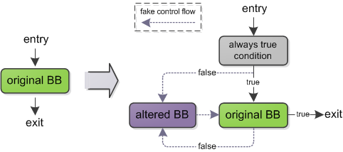

# OLLVM 笔记1 - 虚假控制流(Bogus Control Flow)

有了 LLVM 这一系统，我们可以更方便地在其 IR 上进行一些变换，达到增加破解难度、提高程序安全性的目的。LLVM-Obfuscator （以下简称 ollvm）就是这样一个项目，该项目是瑞士西北应用科技大学安全实验室开发的开源代码混淆工具，其目的是为了增加逆向工程的难度，保证代码的安全性。项目地址：https://github.com/obfuscator-llvm/obfuscator 。

在此对 ollvm 混淆的原理结合代码进行分析，为保护程序安全提供一些参考和思路。本节研究的是 ollvm 中混淆的一种方式 —— 伪造控制流（Bogus Control Flow）。

### 基本原理

对要被混淆的函数，根据设定的概率随机选取基本块，进行混淆处理。基本块前添加一个永远为真的条件判断，其 true 分支为原基本块，false 分支为混淆块。混淆块为拷贝原基本块并添加了一些垃圾指令后生成的块。原基本块结尾替换为另一个总为真的条件转移命令，其 true 分支为原 terminator， false 分支为混淆块。混淆块结尾又控制转移至原基本块，从而伪造出虚假的循环执行流。

Ollvm 使用的 always true 条件为 `y < 10 || x *(x + 1)%2 == 0`，其中 x 和 y 为两个全局整型量。

### 代码分析

Bogus Control Flow 具体的变换代码在文件`lib/Transforms/Obfuscation/BogusControlFlow.cpp`中。

- `runOnFunction()`：重载`FunctionPass`类的接口函数。先判断函数是否需要混淆（`Utils.cpp`->`toObfuscate()`），再调用函数`bogus()`进行混淆，最后调用`doF()`进行处理。

- `bugus()`：混淆可以进行多轮。每次遍历所有的基本块，并根据随机生成的值是否超过概率值选择被混淆的块。调用 `addBogusFlow()`添加混淆逻辑。

- `addBogusFlow()`：对一个基本块添加混淆块。切分基本块，Phi node、debug信息等放在前一个块（没有instruction），指令留在后一个块。创建修改后的基本块作为混淆块。插入一个总为真的浮点数比较作为 condition（会在后续`doF()`中替换）。最后修改执行流完成混淆。

- `doF()`：作用于整个Module。首先建立两个 global value x 和 y，然后找到所有的 always true comparison（predicate 为 FCMP_TRUE），最后将它们全部替换。

## ref:

https://github.com/obfuscator-llvm/obfuscator/wiki/Bogus-Control-Flow

http://mayuyu.io/2017/12/27/BogusControlFlowBug/

http://www.freebuf.com/column/144896.html

  
