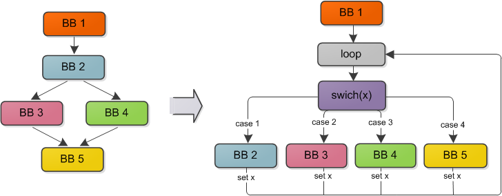

# OLLVM 笔记2 - 控制流平坦化(Control Flow Flattening)

本节研究的是 ollvm 中混淆执行流的另一种方式 —— 控制流平坦化(Control Flow Flattening)。

### 基本过程

顾名思义，控制流平坦化通过将程序执行流拉平的方式进行混淆，
使得转换后程序的执行逻辑不容易被静态分析、难以理解。
平坦化一个程序的基本过程为：

1. 将程序拆分为基本块。将原本相互嵌套的块变为同一级别。

2. 用一个 `switch` 结构封装所有的基本块，使得每个块对应一个 单独的 `case`；而整个`switch` 结构又被一个循环包装起来。

3. `switch` 结构的条件变量作为控制变量，维护原执行流的信息。在每个基本块结束前设置控制变量的值，使得下一次循环执行到正确的块。

### 代码分析

Flattening 的具体代码在文件 `lib/Transforms/Obfuscation/Flattening.cpp` 中。

**runOnFunction()**：重载 `FunctionPass` 类的接口函数。先判断是否要进行平坦化，调用函数`flatten()`进行混淆。

**flatten()**：具体的执行流平坦化逻辑。过程如下：

1. 运行 LowerSwitch Pass，将函数中已有的 switch 结构转换为一系列条件转移语句，方便后续的处理。

2. 建立基本结构：对第一块 basic block 首先进行 split （如果只有一个 block 则不需要 flattening），删除原结尾的转移命令；新建 switch variable 并初始化；建立 loop 结构；建立 switch 结构。等等

3. 处理 switch 结构的分支：将所有基本块至于 switch 结构内部并添加为一个 case。

4. 每个分支插入修改条件变量 switch variable 的逻辑。根据 block 的 terminator 类型的不同，处理方式分别为：

    - ret（后继节点数量为0）：不需要处理

    - 无条件转移（后继节点数量为1）：

        1). 找到该 block 的后继节点

        2). 删除当前 block 的 terminator

        3). 找到后继节点在 switch 结构中对应的 case number。如果是 default case、没有 case number，则随机新建一个在 case 值范围之外的 case number，这样程序执行时便能在下一次 loop 正确地落入 default 分支。

        4). 插入 `StoreInst` 语句，使 block 结尾将 switch variable 的值更新为上一步中找到的 case number，从而保持执行流的正确。

        5). 插入 `BranchInst` 以跳转至 loop 结构。

    - 条件转移（后继节点数量为2）：

        1). 分别获取 true 和 false 分支的 case number。同样地，如果是 default 分支则新建一个 switch 范围外的 case number。

        2). 新建 `SelectInst`，跟据原来的 terminator 的条件分别对应 true 和 false 分支的 case number。

        3). 删除原来的的 terminator

        4). 插入 `StoreInst` 语句，更新 switch variable 的值为 SelectInst 结果，从而保持执行流的正确。

        5). 插入 `BranchInst` 以跳转至 loop 结构。

## ref:

T László and Á Kiss, ** *Obfuscating C++ programs via control flow flattening* ** , Annales Univ. Sci. Budapest., Sect. Comp. 30 (2009) 3-19.

https://github.com/obfuscator-llvm/obfuscator/wiki/Control-Flow-Flattening

http://www.freebuf.com/column/144896.html

https://blog.jscrambler.com/jscrambler-101-control-flow-flattening/

  
