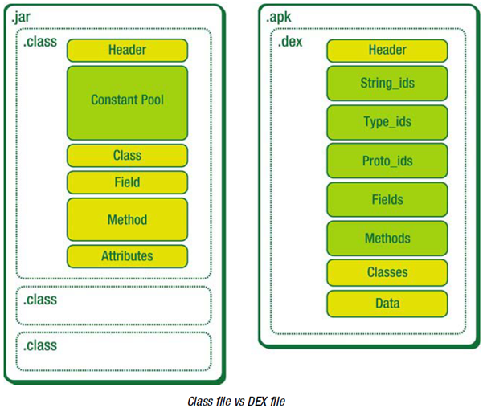

# Dalvik逆向-函数调用

（研究不经反编译获取Android应用的api使用）

## 1. invoke-virtual指令

以invoke-virtual指令为例：

    invoke-virtual/range            {v0..v5}, <void SmsManager.sendTextMessage(ref, ref, ref, ref, ref)

查询Dalvik字节码手册，其指令编码格式为 `75 3rc`.

`3rc`的format格式为`AA|op BBBB CCCC`其中`BBBB`表示函数信息，
invoke-virtual指令从method table指定项里找到目标函数。

## 2. dex文件结构

Dex使用method table记录方法的信息，每个方法有一个ID，代码中使用ID来引用方法。
ID的长度为**2 bytes**。

Dex文件构成如下图。早期Android设备存储空间较小，Dex文件设计成将class文件共有的信息合成一体，减少了冗余。



dex的文件由多个不同结构的数据体以首尾相接的方式拼接而成:

<table>
<thead>
<tr>
<th style="text-align:center">数据名称</th>
<th style="text-align:center">解释</th>
</tr>
</thead>
<tbody>
<tr>
<td style="text-align:center">header</td>
<td style="text-align:center">dex文件头部，记录整个dex文件的相关属性</td>
</tr>
<tr>
<td style="text-align:center">string_ids</td>
<td style="text-align:center">字符串数据索引，记录了每个字符串在数据区的偏移量</td>
</tr>
<tr>
<td style="text-align:center">type_ids</td>
<td style="text-align:center">类似数据索引，记录了每个类型的字符串索引</td>
</tr>
<tr>
<td style="text-align:center">proto_ids</td>
<td style="text-align:center">原型数据索引，记录了方法声明的字符串，返回类型字符串，参数列表</td>
</tr>
<tr>
<td style="text-align:center">field_ids</td>
<td style="text-align:center">字段数据索引，记录了所属类，类型以及方法名</td>
</tr>
<tr>
<td style="text-align:center">method_ids</td>
<td style="text-align:center">类方法索引，记录方法所属类名，方法声明以及方法名等信息</td>
</tr>
<tr>
<td style="text-align:center">class_defs</td>
<td style="text-align:center">类定义数据索引，记录指定类各类信息，包括接口，超类，类数据偏移量</td>
</tr>
<tr>
<td style="text-align:center">data</td>
<td style="text-align:center">数据区，保存了各个类的真是数据</td>
</tr>
<tr>
<td style="text-align:center">link_data</td>
<td style="text-align:center">连接数据区</td>
</tr>
</tbody>
</table>

### header域

header记录了dex文件的一些基本信息，以及一些数据域的分布，例如字符串列表基址(string_ids_off)等。header长度固定为0x70，每一项信息所占用的空间也是固定的。header中包含了方法个数(method_ids_size)和方法列表基址(method_ids_off)。

### string_ids

每个字符串对应一个DexStringId数据结构，大小为4B，虚拟机可以通过乘法运算实现对字符串资源的索引，也可以根据kDexTypeStringIdItem获取字符串。

```c
struct DexStringId {
    u4 stringDataOff;      /* file offset to string_data_item */
};
```

Dex文件中的字符串以**MUTF-8**编码存储。MUTF-8编码其实是对UTF-16字符编码的再编码。如果UTF-16编码的字符值小于等于0x7F（127），则MUTF-8直接用一个字节对其编码，相当于使用ASCII码。

## 3. method table

DexHeader中的methodIdsSize与methodIdsOff字段，指向method table。结构体定义如下：

```c
struct DexMethodId {
    u2  classIdx;           /* 类的类型，指向DexTypeId列表的索引 */
    u2  protoIdx;           /* 声明类型，指向DexProtoId列表索引 */
    u4  nameIdx;            /* 方法名，指向DexStringId列表的索引 */
};
```

即每个method table表项长度为8个字节，其中包含了方法名的字符串索引。

从上可以看到，如果要不经反编译获取dex的Android api使用，可以分析字符串表中是否出现了这些api名称（前提是仅被使用的方法名才会出现在字符串表，待验证）。

如果要获得每个invoke方法使用了哪种api（可以在机器学习特征选取中扩展指令集特征的信息量），可以分析invoke指令的方法对应的method table偏移，进而从相应表项获取nameIdx、从字符串索引找到方法名。

ref:


https://source.android.com/devices/tech/dalvik/dalvik-bytecode?hl=zh-cn

http://www.infoq.com/cn/articles/android-in-depth-dalvik

http://www.jianshu.com/p/f7f0a712ddfe

</br></br>
