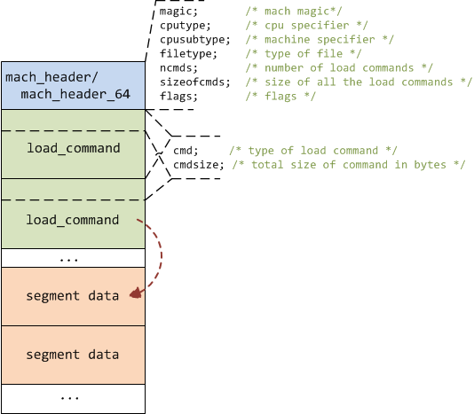

# MACH-O可执行文件

MACH-O(Mach object file)是一种可执行文件格式，运行在Mach平台上。NeXTSTEP, OS X, and iOS are examples of systems that have used this format for native executables, libraries and object code.

## 1. 基本结构

典型的Mach-O文件包含三个部分：


- **Header**：基本信息，包括魔数、cpu类型、load command数量和大小等。

  魔数含有该可执行文件的类型信息。Fat文件魔数为`cafebabe`；Mach-O文件魔数为feedface（32位）和feedfacf（64位）。

  需要注意：不同平台的数据大小端不同，例如Mac和iPhone。从头部的magic可以判断文件的大小端。例如如果FAT文件读取到magic值为`0xbebafeca`（`cafebabe`），则需要在分析文件之前对数据进行swap。

- **Load Commands**：紧接header区域，每一项包含command的类型、segment名称、位置等。segment可能包含若干section。For example, the `__TEXT` segment contains various sections, among those the `__text` section, that contains the actual executable machine bytes. `__cstring` section contains hardcoded C strings used in the program.

  使用`otool -lv`命令可以查看文件头和load commands信息。

- **Data**：包含代码和数据。

OS X上除了 Mach-O 文件还有一种目标文件：Universal Binaries，又称Fat文件。Mach-O 文件只包含一种体系结构的代码，而Fat文件包含多个体系结构的代码，例如i386、 x86_64、arm、arm64。

Fat文件的基本结构是一个fat header后接Mach-O文件。

| **Fat Header** |
| ------------- |
| **Mach-O Header** |
| **Load Commands** |
| **Data** |
| **Mach-O Header** |
| **Load Commands** |
| **Data** |

## 2. FAT文件头

下图展示了FAT文件头数据结构。FAT文件头由一个`fat_header`紧接若干个`fat_arch`结构构成。


`fat_header`：`magic`位于FAT文件最开始，根据`magic`可以判断数据大小端是否一致。（FAT header和其中Mach-O文件的大小端排列还可能不同。）`nfat_arch`表示后面的`fat_arch`结构个数。

`fat_arch`列表紧接`fat_header`。每个表项含有所表示的object文件的cpu类型、偏移位置（相对于FAT文件头）和大小等信息。通过这些信息就能够找到相应的Mach-O文件数据。

## 3. MACH-O文件结构

下图展示了Mach-O文件数据结构



### 3.1 `mach_header`

`mach_header`有32位和64位两种，位于object文件最开始。包含`magic`、`cputype`、`filetype`、`ncmds`等信息。

`magic`可以判断数据大小端和是否为32位或64位。
文件布局由`filetype`决定，例如`MH_OBJECT`、`MH_EXECUTE`、`MH_FVMLIB`、 `MH_DYLIB`、`MH_DYLINKER` 等。`ncmds`表示 load command 的个数。

### 3.2 `load_command`

Load command 紧接`mach_header`，开头必须包含`cmd`和`cmdsize`两个字段。Load command
的具体布局根据`cmd`表示的类型而定。`cmdsize`表示Load command的大小（字节数）。根据当前 Load command 的偏移和`cmdsize`，可以对 Load commands 进行遍历。

> The cmdsize for 32-bit architectures
 MUST be a multiple of 4 bytes and for 64-bit architectures MUST be a multiple
  of 8 bytes (these are forever the maximum alignment of any load commands).
  The padded bytes must be zero.

### 3.3 segment_command 和 section

`load_command` 中类型为`LC_SEGMENT`的，表示该部分是一个 `segment_command`、需要映射到进程的地址空间中。一个 segment 由0或若干个 section 组成。下图展示了`segment_command` 的结构。


 Non-MH_OBJECT files have
  all of their segments with the proper sections in each, and padded to the
  specified segment alignment when produced by the link editor.  **The first
  segment of a MH_EXECUTE and MH_FVMLIB format file contains the mach_header
  and load commands of the object file before its first section.**  The zero
  fill sections are always last in their segment (in all formats).

以下是一些常用的 segment：

- **__PAGEZERO segment** ：可执行文件的第一个segment，在虚拟内存中位置（vmaddr）为0x00000000，大小是一页（vmsize=0x00004000）。作用是充当空指针陷阱。由于PAGEZERO segment中没有数据，所以Mach-O文件中不占用空间（`filesize`=0）。

- **__TEXT segment** ：包含了可执行代码和其他只读的数据。`__TEXT` segment 的 `__text` section 含有可执行的机器码。

  (由于`__PAGEZERO` segment不含数据，`__TEXT` segment 为实际的第一个段，包含了 Mach-O header 和 Load commands。`__TEXT` segment 的`fileoff`=0，即对应于文件最开头。)

- **__DATA segment** ：包含了可读和写的数据。

- **__OBJC segment** 包含了Objective-C语言运行时支持库

- **__IMPORT segment** 包含了在可执行文件中的没有被定义的符号集合和非lazy的指向符号的指针。

- **__LINKEDIT segment** 包含了动态链接器的原始数据，如符号、字符串和重定位的表的入口。


## 附：数据结构

Mach-O文件的相关数据结构（参考`<mach-o/loader.h>`文件）：

```c
struct mach_header {
	uint32_t	magic;		/* mach magic number identifier */
	cpu_type_t	cputype;	/* cpu specifier */
	cpu_subtype_t	cpusubtype;	/* machine specifier */
	uint32_t	filetype;	/* type of file */
	uint32_t	ncmds;		/* number of load commands */
	uint32_t	sizeofcmds;	/* the size of all the load commands */
	uint32_t	flags;		/* flags */
};
#define	MH_MAGIC	0xfeedface	/* the mach magic number */
#define MH_CIGAM	0xcefaedfe	/* NXSwapInt(MH_MAGIC) */

struct mach_header_64 {
	uint32_t	magic;		/* mach magic number identifier */
	cpu_type_t	cputype;	/* cpu specifier */
	cpu_subtype_t	cpusubtype;	/* machine specifier */
	uint32_t	filetype;	/* type of file */
	uint32_t	ncmds;		/* number of load commands */
	uint32_t	sizeofcmds;	/* the size of all the load commands */
	uint32_t	flags;		/* flags */
	uint32_t	reserved;	/* reserved */
};
#define MH_MAGIC_64 0xfeedfacf /* the 64-bit mach magic number */
#define MH_CIGAM_64 0xcffaedfe /* NXSwapInt(MH_MAGIC_64) */

struct load_command {
	uint32_t cmd;		/* type of load command */
	uint32_t cmdsize;	/* total size of command in bytes */
};

struct segment_command {
  uint32_t  cmd;
  uint32_t  cmdsize;
  char      segname[16];
  uint32_t  vmaddr;
  uint32_t  vmsize;
  uint32_t  fileoff;
  uint32_t  filesize;
  vm_prot_t maxprot;
  vm_prot_t initprot;
  uint32_t  nsects;
  uint32_t  flags;
};

struct segment_command_64 { /* for 64-bit architectures */
	uint32_t	cmd;		/* LC_SEGMENT_64 */
	uint32_t	cmdsize;	/* includes sizeof section_64 structs */
	char		segname[16];	/* segment name */
	uint64_t	vmaddr;		/* memory address of this segment */
	uint64_t	vmsize;		/* memory size of this segment */
	uint64_t	fileoff;	/* file offset of this segment */
	uint64_t	filesize;	/* amount to map from the file */
	vm_prot_t	maxprot;	/* maximum VM protection */
	vm_prot_t	initprot;	/* initial VM protection */
	uint32_t	nsects;		/* number of sections in segment */
	uint32_t	flags;		/* flags */
};

struct section { /* for 32-bit architectures */
	char		sectname[16];	/* name of this section */
	char		segname[16];	/* segment this section goes in */
	uint32_t	addr;		/* memory address of this section */
	uint32_t	size;		/* size in bytes of this section */
	uint32_t	offset;		/* file offset of this section */
	uint32_t	align;		/* section alignment (power of 2) */
	uint32_t	reloff;		/* file offset of relocation entries */
	uint32_t	nreloc;		/* number of relocation entries */
	uint32_t	flags;		/* flags (section type and attributes)*/
	uint32_t	reserved1;	/* reserved (for offset or index) */
	uint32_t	reserved2;	/* reserved (for count or sizeof) */
};

struct section_64 { /* for 64-bit architectures */
	char		sectname[16];	/* name of this section */
	char		segname[16];	/* segment this section goes in */
	uint64_t	addr;		/* memory address of this section */
	uint64_t	size;		/* size in bytes of this section */
	uint32_t	offset;		/* file offset of this section */
	uint32_t	align;		/* section alignment (power of 2) */
	uint32_t	reloff;		/* file offset of relocation entries */
	uint32_t	nreloc;		/* number of relocation entries */
	uint32_t	flags;		/* flags (section type and attributes)*/
	uint32_t	reserved1;	/* reserved (for offset or index) */
	uint32_t	reserved2;	/* reserved (for count or sizeof) */
	uint32_t	reserved3;	/* reserved */
};
```

FAT文件结构可参考`<mach-o/fat.h>`中的定义：

```c
#define FAT_MAGIC	0xcafebabe
#define FAT_CIGAM	0xbebafeca	/* NXSwapLong(FAT_MAGIC) */

struct fat_header {
	uint32_t	magic;		/* FAT_MAGIC */
	uint32_t	nfat_arch;	/* number of structs that follow */
};

struct fat_arch {
	cpu_type_t	cputype;	/* cpu specifier (int) */
	cpu_subtype_t	cpusubtype;	/* machine specifier (int) */
	uint32_t	offset;		/* file offset to this object file */
	uint32_t	size;		/* size of this object file */
	uint32_t	align;		/* alignment as a power of 2 */
};

```

## ref

https://lowlevelbits.org/parsing-mach-o-files/

http://www.blogfshare.com/ioss-mach-o.html

https://github.com/gdbinit/MachOView

https://github.com/kpwn/iOSRE/blob/master/wiki/Mach-O.md

https://www.jianshu.com/p/d43a8279a1c2

http://sky-weihao.github.io/2015/06/05/executable_mach_o_file/

</br></br>
