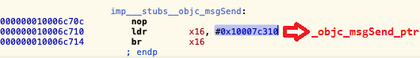
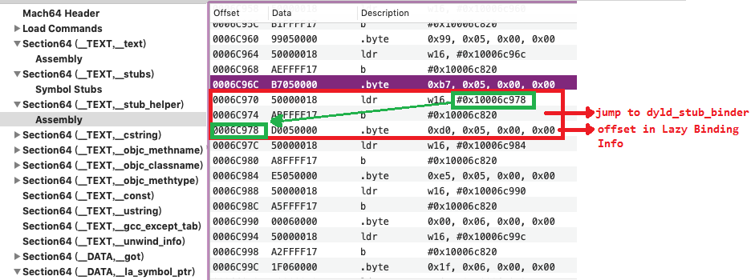
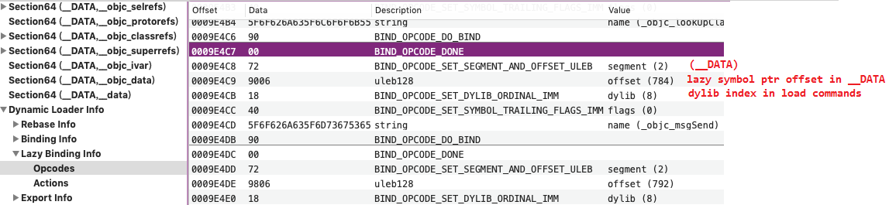
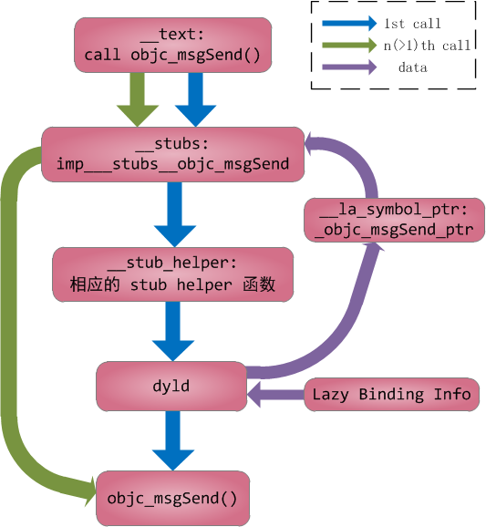

# Mach-O 程序加载过程

2018-10

关于 Mach-O 程序的加载过程（dyld代码）、Mach-O 程序动态链接的原理。

## 1. 准备

静态分析工具：hopper、MachOView，一个用来分析的 Mach-O 程序文件。也可以结合 Apple 源码进行调试，看得更清楚。

了解 Mach-O 文件的基本结构（通过 MachOView 查看基本结构更清楚）。本篇涉及的主要结构有：

- Section `__TEXT, __stubs`: 跳转表，用来间接调用外部函数。

- Section `__TEXT, __stub_helper`: 存放一系列辅助函数，调用 dylib 来 bind 相应的外部函数。

- Section `__DATA, __got`: Non-lazy symbol pointers.

- Section `__DATA, __la_symbol_ptr`: Lazy symbol pointers.

- Segment `__LINKEDIT`: 包含 Dynamic loader info （rebase 和 bind 所需信息）。`__LINKEDIT` 的内容由一个特殊的 load command `DYLD_INFO` 决定。

## 2. 二进制文件加载过程

dyldStartup.s: `__dyld_start` : dyld 加载过程的开始，保存 frame 和设置相应参数后，调用 `_main`.

dyld.cpp: `_main`: 进行整个 Mach-O 文件的加载过程。包括：

1. 初始化一些运行环境（执行目录、环境变量等）

2. 实例化 ImageLoader （main executable 在 dyld 获得控制权之前已经被内核加载了。）

3. 加载插入的动态库

4. **link** 主程序和动态库。

5. 调用 initializers。

## 3. link 过程

link 过程中进行的操作有：

**a. rebase**：由于动态库加载的内存地址是不固定的，需要修复 image 中的指针。所需要的信息在 Mach-O 文件的 Dynamic Loader Info => Rebase Info 中（记录了指针所在的位置）。Dynamic Loader Info 对应的 load command 为 `LC_SEGMENT(__LINKEDIT)`。rebase 的详细过程可参考 `recursiveRebase()` 函数实现。

**b. bind**：填入当前 image 中引用的外部符号。程序如何在运行时使用 NSObject 等定义在其他文件中的类和方法呢？这就依靠 binding 操作。ImageLoader 根据 Dynamic Loader Info => Binding Info 中的信息，在需要的位置填入外部符号的内存地址。从 MachOView 中可以看到，Binding Info 中包含：符号所在的 dylib 在本程序的 load command中的序号、符号名字符串、要修改的指针的 offset（uleb128格式）。

通常只有 non-lazy pointers 在程序加载时由 ImageLoader 进行 bind （参考 `recursiveBind()` 函数）。这些 pointer 通常包括：1）外部类的指针(struct objc_class*)，包括代码中使用的位于 `__objc_classrefs` 的指针和 Section `__objc_data` 中的类引用；2）`__got` 表中的函数指针。Hopper中可以看到，这些位置原本的值为 0。

c. weakBind （没研究）

> add_image callback 在 bind 完成之后调用，因此，执行顺序上是：
> add_image callback => initializers => mod_init_func => _main

## 4. lazy bind

Lazy pointers 并没有在加载过程中直接确定地址，而是在第一次调用函数的时候，通过 Lazy Binding 填入地址。

为便于理解，首先在 Hopper 中打开程序静态分析下外部函数的调用过程。以函数 `objc_msgSend` 为例，可以看到：

1. 代码中要调用该函数时实际首先跳转到符号 `imp___stubs__objc_msgSend`，位于 `__TEXT, __stubs` 。stub是一小段代码，作用是从相应的 lazy pointer 读取地址并跳转。
在函数第一次调用、还没有进行 bind 时， lazy pointer 中保存的是相应的 stub_helper 函数地址

  

2. `__stub_helper` 的结构如下图，每个 `__stub_helper` 的工作是准备参数（相应的 lazy Binding info 在整个 lazy Binding info 区域的 offset）并调用 dyld_stub_binder。

  

  

  dyld_stub_binder 根据参数在 Lazy Binding Info 中找到并解析相应项，找到相应的库和函数，将地址填入相应的 lazy Symbol Pointer，最后执行要调用的函数（see `stub_binding_helper.s`）。因此，当下一次调用函数，stub 直接从 lazy pointer 中获取了函数的真实地址并执行。

  下面的图是对 lazy bind 执行过程的一个总结：

  

## ref

Apple 源码下载： https://opensource.apple.com/tarballs/

dyld 源码：https://opensource.apple.com/source/dyld

dyld与ObjC： https://blog.cnbluebox.com/blog/2017/06/20/dyldyu-objc/

关于 rebase、bind 等： https://www.jianshu.com/p/44fc9b1bb2a0

DYLD Detailed： http://newosxbook.com/articles/DYLD.html

fishhook 原理（lazy bind参考）：http://m.desgard.com/2017/12/17/fishook-1/index.html

  
