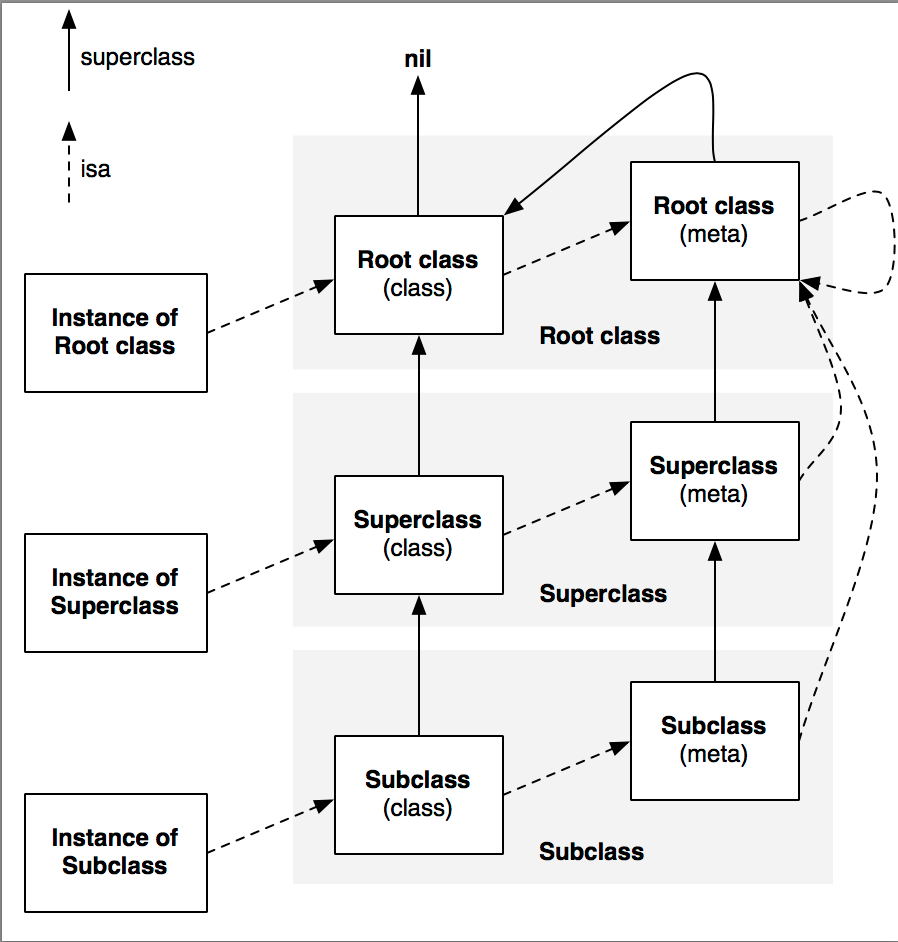

# Objective-C 运行时

2018-10

## 1. Mach-O 文件中的结构

Mach-O 文件中与 Object C 相关的一些结构：

- Section `__DATA, __objc_classlist`:类结构体的索引，是一串指向 `class_t` 结构体（见附录）的指针（Mach-O 文件中为虚地址）。

- Section `__DATA, __objc_catlist`: Category 结构体的索引，是一串指向 `category_t` 结构体的指针。

- Section `__DATA, __objc_data`: 存放 `class_t` 结构体，包括 class 和 metaclass 。【`class_t` 结构体不一定是连续存放的】

- Section `__DATA, __objc_const`: 存放 `class_ro_t` 和一些类信息，包括方法列表和结构体、Property 列表和结构体、Ivar 列表和结构体。

- Section `__TEXT, __methname`: 存放类方法名字符串。

- Section `__TEXT, __objc_classname`: 存放类名称字符串。

运行时程序 image 被加载到内存后，上面所有的指针变成直接指向相应内存地址。

## 2. 二进制文件加载过程

参考 《Mach-O 程序加载过程》，基本过程包括：环境初始化、加载动态库、link & rebase、 call initializers。

## 3. Objc 相关结构(静态文件)

Objc程序中，`__objc_classlist` Section 包含了该程序中定义的类结构的索引，其中每个指针指向相应的类的 `class_t` 结构体，其中包括指向基类和元类的类结构体指针、指向 `class_ro_t` 结构体的指针。


（盗个图，类、基类、元类的 `class_t` 引用关系）

<center>

</center>
</br>

`class_ro_t` 中包含类名，以及 Method、Property、Protocol、Ivar 列表等。metaclass 的方法列表中包含的是类方法（前面带 "+" 号的），class 方法列表中是实例方法（前面带 "-" 号的）。


## 4. Realize 后的 class 结构

当类的方法第一次被调用时，首先要对类进行初始化。（换句话说不单单要加载静态文件中的类相关结构体、rebase指针，runtime还要对 Objc 类做其他初始化工作。）具体的实现可查看 objc-runtime-new.m 中的 `realizeClass()` 函数。可以看到，`class_t` 中的 data 指针被替换为另一个结构 `class_rw_t`，该结构中包含了方法、peoperty等列表以及到  `class_ro_t` 的指针。具体一个类有没有被 realize 过，是通过 flag 来判断的。

对带有 +load 方法的类，在系统调用 initializer 的时候就会对类进行初始化，即 `_main` 函数调用之前这些类就已经被初始化了。


## 5. 关于 category

category 中的方法会在类初始化的过程中添加到类的方法表中，具体的过程为：realizeClass => methodizeClass => attachCategoryMethods => attachMethodLists。attachMethodLists 会将待添加的方法添加在原列表的前面，因此 category 中的方法会覆盖被扩展的类中的同名方法。

通过 category 可以为系统类添加 load 方法，这样该 load 方法会在系统库加载的时候就调用了。

## 附：数据结构定义

参考 MachOView 源码

```ObjC
struct class_t
{
  uint32_t isa;               // class_t * (32-bit pointer)
  uint32_t superclass;        // class_t * (32-bit pointer)
  uint32_t cache;             // Cache (32-bit pointer)
  uint32_t vtable;            // IMP * (32-bit pointer)
  uint32_t data;              // class_ro_t * (32-bit pointer)
};

struct class_ro_t
{
  uint32_t flags;
  uint32_t instanceStart;
  uint32_t instanceSize;
  uint32_t ivarLayout;        // const uint8_t * (32-bit pointer)
  uint32_t name;              // const char * (32-bit pointer)
  uint32_t baseMethods;       // const method_list_t * (32-bit pointer)
  uint32_t baseProtocols;     // const protocol_list_t * (32-bit pointer)
  uint32_t ivars;             // const ivar_list_t * (32-bit pointer)
  uint32_t weakIvarLayout;    // const uint8_t * (32-bit pointer)
  uint32_t baseProperties;    // const struct objc_property_list * (32-bit pointer)
};

struct class64_t
{
  uint64_t isa;               // class_t * (64-bit pointer)
  uint64_t superclass;        // class_t * (64-bit pointer)
  uint64_t cache;             // Cache (64-bit pointer)
  uint64_t vtable;            // IMP * (64-bit pointer)
  uint64_t data;              // class_ro_t * (64-bit pointer)
};

struct class64_ro_t
{
  uint32_t flags;
  uint32_t instanceStart;
  uint32_t instanceSize;
  uint32_t reserved;
  uint64_t ivarLayout;        // const uint8_t * (64-bit pointer)
  uint64_t name;              // const char * (64-bit pointer)
  uint64_t baseMethods;       // const method_list_t * (64-bit pointer)
  uint64_t baseProtocols;     // const protocol_list_t * (64-bit pointer)
  uint64_t ivars;             // const ivar_list_t * (64-bit pointer)
  uint64_t weakIvarLayout;    // const uint8_t * (64-bit pointer)
  uint64_t baseProperties;    // const struct objc_property_list * (64-bit pointer)
};
```

参考苹果 objc-runtime-new.h 源码：

```ObjC
typedef struct class_rw_t {
    uint32_t flags;
    uint32_t version;

    const class_ro_t *ro;

    struct method_list_t **methods;
    struct chained_property_list *properties;
    struct protocol_list_t ** protocols;

    struct class_t *firstSubclass;
    struct class_t *nextSiblingClass;
} class_rw_t;
```

## ref

Apple 源码下载： https://opensource.apple.com/tarballs/

https://tech.meituan.com/DiveIntoCategory.html

</br></br>
