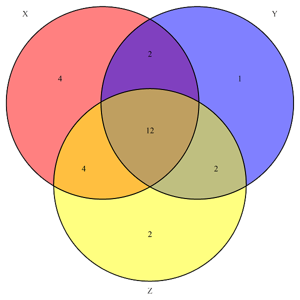
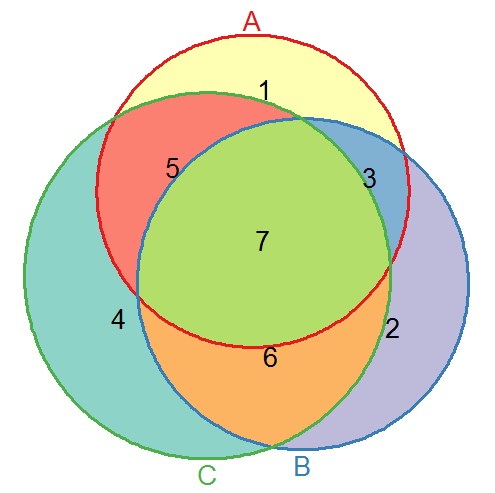
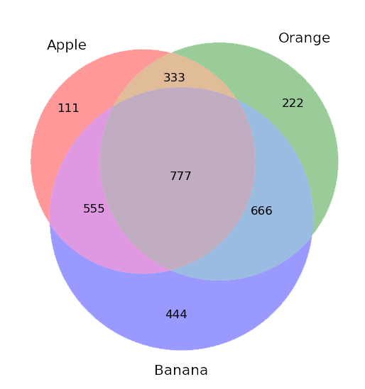

# R语言画韦恩图

## 1. Start

官网下载安装运行环境：
https://www.r-project.org/
。 安装完成后运行R console，这是一个类似python解释执行的运行环境。

R语言包括6种基本数据类型： Logical, Numeric, Integer, Complex(复数), Character, Raw（原型）。

R语言数据结构包括：向量(Vector)，矩阵(Matrix)，列表(List), 数据(Data Frame)等。
- Vector的所有的元素必须是同一类型，使用函数`c()`创建一个vector:
   `name <- c("Mike", "Lucy", "John") `
- Matrix是一种特殊的vector。Maxtrix是一个拥有两个额外属性：行数和列数.
- Array类似于maxtrix，但可以是二维以上。
- List可以包含不同类型的元素。
- Data Frame用于存储数据表，它是元素为vector的list。

一些基本使用：
- mode()  返回对象的类型，用来定位问题很方便。
- length()  返回对象长度
- typeof()  返回数据类型


## 2. 代码

```R
# load library(need to install VennDiagram module first)
library(VennDiagram)

# define the vectors
x <- c(1,3,5,7,9,11,17,19,21,23,25,29,31,33,37,39,41,47,49,51,57,59)
y <- c(1,3,5,7,13,17,19,21,23,25,27,29,31,33,45,47,51)
z <- c(1,3,5,7,9,11,13,15,17,19,21,23,25,27,29,31,33,35,37,39)

# draw Venn-plot as an output file.
venn.diagram(list(X=x,Y=y,Z=z),fill=c("red","blue","yellow"),"out.tiff")

```



venn.diagram函数详细说明：
http://finzi.psych.upenn.edu/R/library/VennDiagram/html/venn.diagram.html

## 3. 从文件读取数据

R可以用下面的函数读取存储在文本文件（ASCII）中的数据：read.table
、scan和read.fwf。
R也可以读取以其他格式的文件(Excel, SAS, SPSS, . . . ) 和访问SQL类型的数据库。

read.table的几个变种read.csv、read.csv2、read.delim、read.delim2可以用在几种不同情况。

`data <- read.table("data.dat")` 从文件data.dat中读取dataframe命名为data，其中每个变量名称的缺省值为V1, V2, ... ，可通过`data["V1"], data["V2"]` 访问。

以下代码从csv文件中读取数据并绘制韦恩图。

```R
table1 = read.csv("C:\\...\\name1.csv", header=TRUE, sep=",", fill=FALSE)
name1 <- table1["name"]
# Header name is "name"

table2 = read.csv("C:\\...\\name2.csv", header=TRUE, sep=",", fill=FALSE)
name2 <- table2["name"]

table3 = read.csv("C:\\...\\name3.csv", header=TRUE, sep=",", fill=FALSE)
name3 <- table3["name"]

venn.diagram(list(Name1=name1[[1]],Name2=name2[[1]],Name3=name3[[1]]),fill=c("red","blue","yellow"),"C:\\...\\1.tiff")

```

注意，List中元素的访问需要双层`[[]]`，如果单层`[index]`或`[tag_name]`会访问子list。

## 4. 带有面积比例的Venn图

Vennerable能够在R中画出含有面积比例的Venn图。

### 安装Vennerable包：

1. 官网下载安装包文件：https://r-forge.r-project.org/R/?group_id=474
2. R Gui选择：程序包 -> install package from local files -> 选择文件进行安装
3. 若需要安装其他依赖包，使用如下命令：
  ```R
  source("http://bioconductor.org/biocLite.R")
  biocLite("RBGL")    # install "RBGL" and "graph" module
  install.packages("RColorBrewer")    # install "RColorBrewer" module
  install.packages("reshape")
  ...
  ```
  直到 `library(Vennerable)` 加载Vennerable包成功。

### 绘制带比例的Venn图

代码示例：
```R
library(Vennerable)    #载入Vennerable
x <- c(1:100)    #建立1~100的正整数集
y <- c(51:200)    #建立51~200的正整数集
data <- Venn(list("SetA"=x,"SetB"=y))    #Process data
plot(data,doWeight=T)    # doWeight参数决定是否按比例绘图
```

缺点：数据量很多时处理数据可能卡死。
可以先通过VennDiagram计算得到各部分面积值，再使用Vennerable绘制成比例Venn图：

```R
data <- Venn(SetNames= c("A","B","C"), Weight=c(0,1,2,3,4,5,6,7))
```



ref:

http://finzi.psych.upenn.edu/R/library/utils/html/read.table.html
http://matticklab.com/index.php?title=Weighted_Venn_diagrams_in_R

## 附：Python绘制Venn图

matplotlib-venn包可以绘制2元和3元的韦恩图。
依赖包：matplotlib, scipy, numpy

以venn2函数为例，既可以接受一个表示各子集(Ab,aB,AB)大小的tuple作为参数，
也可以输入集合本身进行计算：
```python
venn2(subsets=(3, 2, 1), set_labels=('A', 'B'))

venn2([{'A', 'B', 'C', 'D'}, {'D', 'E', 'F'}])
```

以下代码用于绘制一个三元Venn图：
```python
# coding=utf-8
import matplotlib.pyplot as plt
from matplotlib_venn import venn3

# (Abc, aBc, ABc, abC, AbC, aBC, ABC)
subsets = (111, 222, 333, 444, 555, 666, 777)

plt.figure(figsize=(4, 4))
v = venn3(subsets=subsets, set_labels=('Apple', 'Orange', 'Banana'))

plt.show()
```



Python绘制的Venn图稍微好看一些。

ref:

http://blog.csdn.net/lanchunhui/article/details/50667052
https://pypi.python.org/pypi/matplotlib-venn

<br/><br/>
